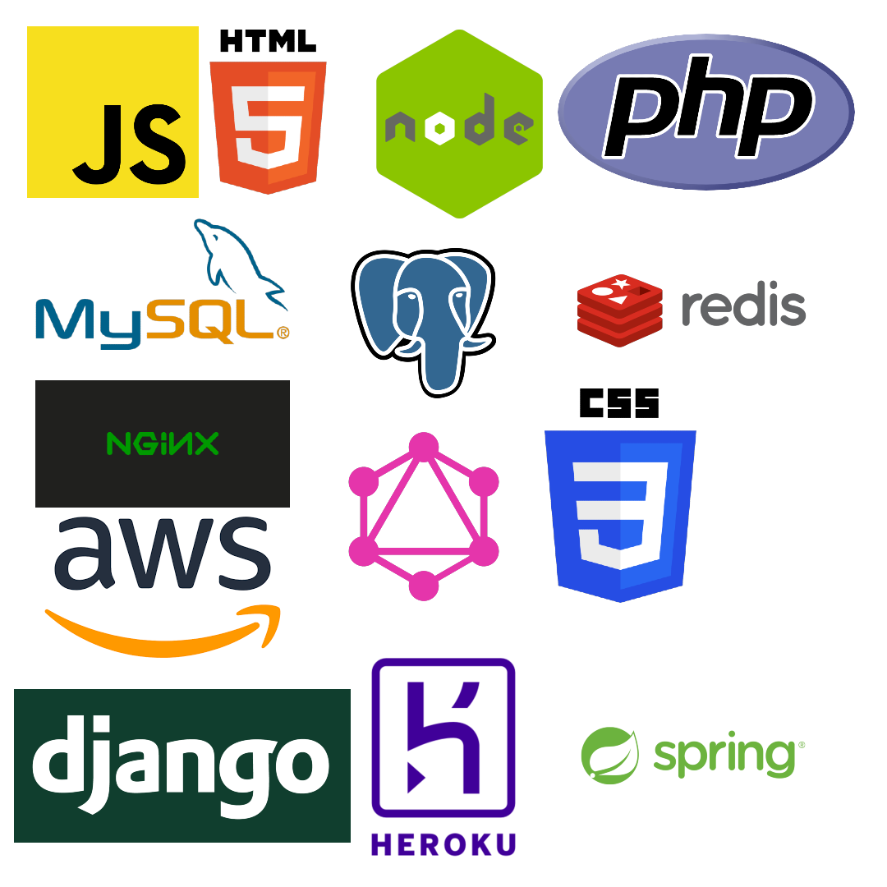

# Introduction and Purpose
If you have experience working or experimenting with software, you would probably agree that there are a lot of areas to explore in software that utilize different tools. This post aims to give some insight into a few of the many use cases of software in the world for individuals new to software. One aspect of almost all uses of software include the automated, optimized, and abstracted manipulation of data which is why software is so intertwined with mathematics.

## Abstraction is Key - 1011 1011 0100 1101
Software runs on hardware so it is worth briefly discussing hardware through a tour of increasing abstraction of physical devices. It amazes me how so many brilliant people have built off of each other through history.

1. Computers store and manipulate data using electrical states of high or low voltages in wires (1 or 0) known as binary. 
2. Each digit in binary is a bit (ex: 1) and 8 bits are a byte (ex: 1010 0100). 
3. Transistors can combine these voltages to create new outputs based on these 1s and 0s. 
4. Logic gates are composed of transistors which can compare binary inputs to create known outputs. 
5. Logic gates can be used to create components that can store a voltage or add bits. 
6. These circuits can be used to create modules such as registers and ALUs. 
7. These modules can be used to create computer chips like RAM and the CPU.
8. Programmers can load binary into RAM to execute programs.

As you can see from this very generalized overview, computers heavily use abstraction to hide a bunch of complex information into modules to be reused. From here, many programming languages and environments have been developed to transform human readable commands into binary or machine code. Operating systems have also been created to ease the transition from the software side of a computer to the hardware side.

## Technology Mountain
I will now attempt to list a few popular categories in the software world.
* Application Development - Mobile, Desktop, Games
* Web Development - Backend, Frontend, Full stack
* Scripting
* AI and Machine Learning - Data Science, Mathematics, Scientific Research
* Embedded Devlopment

Here are some critical tools used throughout all software fields.
1. Git and a remote host for saving and working on text files throughout a complex organisation (ex: GitHub, GitLab, Bitbucket)
2. IDE and/or code editor for modifying these text files efficiently (ex: vscode, JetBrains products, notepad++)
3. Terminal for automating repetative tasks (ex: bash, zsh, Powershell)
4. Discrete math, algroithms, and data structures for solving extremely complex software problems once (hopefully)

## Application Development
Application development involves creating programs that can directly run on a computer typically consisting of a user interface. Application developlement can be split into mobile development (phones) and desktop development (desktop computers), but application development can involve other types of computers such as the Xbox or Nintendo Switch.

Software that is developed for specific operating systems usually uses the software tools dedicated to that OS. For example, IOS uses the Swift language and Android uses Java or Kotlin. In the general, applications such as Microsoft Word, web browsers, video games, or any installed apps fall under this broad category.

### Game Development
Game development is interesting as it forms a combination of many art forms such as writing, visual art, and music to create a modern and unique experience. Although one could attempt to create a game without the help of additional software by using C or Java, almost 100% of the time, a game engine is used by game developers to immensely speeed up this process. Game engines provide tools such as physics engines, dragging and dropping, asset management, and abstraction to allow a game to be created quickly and distributed for many platforms without having to completely rewrite game code for Windows, Mac, PS4, etc.

The most popular game engines as of writing this post include Unity and Unreal engine. Triple A companies like EA write their own private game engines that are specially designed for the games they create. Typically, C# and C++ are used as programming languages in game development.

## Web Development

The web development landscape is vast and there are constantly more frameworks and technologies to choose from. Web development is generally split into two categories - backend and frontend. However, an increasingly more common approach is to have developers work on both the frontend and backend of a web application. They are known as full stack developers.

### Backend
Backend development consists of managing the software that runs on actual machines. This can include interacting with databases, working with cloud hosting services, managing user authentication, and managing client-server interactions. Common terms in this field include ORM, REST API, Containers, and middleware. Common technologies include Docker, Node JS, MySQL, MongoDB, PostgreSQL, Django, Java Spring, GraphQL, PHP, and NGINX.

### Frontend
Frontend development consists of managing software that runs on web browsers or the graphical user interface (GUI) of an application. These developers tend to focus on fetching data from the backend, manipulating it, and then displaying the data for the user. Often times frontend developers will interact with different services that provide their user interface with data to be displayed in a fancy way to the user. The most common frontend technologies currently include ReactJS, AngularJS, VueJS, and of course the core web languages which are Javascript, CSS, and HTML.

## Scripting
Scripting involves the use of high-level languages such as Python, Perl, or Ruby to carry out repetative tasks. For example, if you wanted to find all the sales on an online store or gather some data from a website, a scripter could write a program that automatically gathers this data for you without the need for labourious typing on a keyboard. Although scripting programs are usually not interacted with by the public as opposed to some application with a GUI, scripting can be extremely useful to increase productivity or scout out large amounts of data.

## AI and Machine Learning
Machine Learning and AI heavily utilize mathematics to perform complex tasks that do not have conforming cases to check. Often times, when developing software in this field, some sort of framework or library is developed for the programmer to use so that all of the complex math and more difficult to write software is hidden. While AI generally focuses on solving problems from more of an algorithmic programming perspective, machine learning uses the power of math to make predictions.

The application of machine learning is immense ranging from facial recognition, moving robots safely, and diagnosing cancer from medical images. In machine learning, a bunch of numbers are stored, updated, and used to output another number. Often times things like images or robot movement can be simplified to a bunch of numbers and then predictions can be made from these numbers. Common technologies used in machine learning include Tensorflow and Pytorch. The basic math foundations are built off of regressions, neural networks, and data manipulation.

## Embedded
Embedded development includes creating software that runs on minimal hardware including watches, household appliances, and medical devices. Since these devices are usually restricted in the amount of hardware available to run software, programming languages such as C and C++ are commonly used as they do not require additional overhead and can be compiled directly into binary. Since embedded development is tied so closely to hardware, usually a good understanding of electrical circuits and communication protocols are necessary to send and recieve signals on tiny computers.

As opposed to desktop microprocessors (MPUs), embedded devices can have small computers called microcontrollers (MCUs) instead. MCUs usually do not run large applications or large operating systems like Windows to save on hardware usage. The Arduino is a very popular MCU that is used for hobbyist embedded development, but in practice other MCUs are used for more control. The Raspberry Pi is another fascinating embedded MPU that is actually a small computer with an operating system.

## Conclusion
Hopefully this gives some small overview of the state of software in 2022. Of course, software is changing rapidly so most of these technologies may be replaced after a few years or decades, but it will be interesting to see what software fields will become popular in the future.

---
Thanks for reading and have an awesome day!