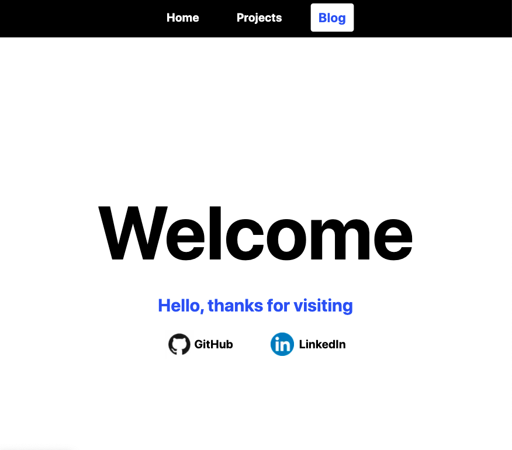

# The Idea
As discussed on the [about page](/posts/About), one of my friends inspired me to create a blog site and I really enjoy reading articles on sites such as [Medium.com](https://medium.com/). I had recently heard about the power of a web development technology called [NextJS](https://nextjs.org/) and decided to do some more research. For this site, I wanted a blog section to write articles as well as a project page to display my web-based projects and present my other technical projects.

## Step 1: The Technology
After some more research on how to create a blog site, I found some possible options with some pros and cons.

### Options
[WordPress](https://wordpress.com/) and other site generators
* Pro: extremely popular with 43% of the web built on it
* Pro: easy and streamlined tools to create and deploy the site
* Pro: ability to add plugins
* Con: not "Close to the Metal" (abstraction from lower level technology. Web technologies are notoriously high-level)
* Con: less control (debatable)

[GitHub Pages](https://pages.github.com/)
* Pro: integrates easily with [GitHub](https://github.com/)
* Pro: uses Jekyll to easily create Markdown pages
* Pro: easy to deploy
* Con: not "Close to the Metal" (but closer than WordPress)
* Con: less control

Plain HTML/CSS/Javascript and a web hosting site
* Pro: closer to the metal
* Pro: full control
* Con: difficult to maintain
* Con: can be slow

Frontend frameworks like [ReactJS](https://reactjs.org/) and [VueJS](https://vuejs.org/)
* Pro: closer to the metal
* Pro: lots of control
* Pro: easy to maintain
* Con: harder to learn
* Con: easy to make mistakes

### Decision
I really want to learn how modern technologies work, so I decided to use a frontend framework over the other options. Specifically, I decided to use NextJS because of its fast static site rendering ability and [TailwindCSS](https://tailwindcss.com/) because it is lightweight and it speeds up CSS styling. NextJS also integrates very easily with [Vercel](https://vercel.com/) which allows deployment of the site every time I push a commit to the remote GitHub repository.

## Part 2: Resources
I will admit, it took me a long time to figure out how these technologies worked even with the help of these awesome resources:
* [NextJS Docs/Tutorial](https://nextjs.org/learn/basics/create-nextjs-app?utm_source=next-site&utm_medium=homepage-cta&utm_campaign=next-website)
* [Tailwind Docs](https://tailwindcss.com/docs/installation)
* [Traversy Media Tutorial](https://www.youtube.com/watch?v=MrjeefD8sac)
* [Node Package Manager for information on specific packages](https://www.npmjs.com/)
* [React Docs](https://reactjs.org/docs/getting-started.html)

## Part 3: Blog Framework/Generator
Let's start with the blog portion of the site.
### Markdown
Most tutorials I looked at recommended using Markdown to create static blog sites. Markdown is a type of text based styling language that allows the writer to style text using symbols while typing text similar to that in a text editor. For example, here is some Markdown for this blog post:

```markdown
## Step 1: The Technology
After some more research on how to create a blog site, I found some possible options with some pros and cons.

### Options
[WordPress](https://wordpress.com/) and other site generators
* Pro: extremely popular with 43% of the web built on it
```

This format makes it very easy to write posts while integrating images, code blocks, and headings without needing to manually create pages in other languages. This Markdown information can then be turned into a web page using various tools such as [react-markdown](https://www.npmjs.com/package/react-markdown) and [gray-matter](https://www.npmjs.com/package/gray-matter) that can convert Markdown into HTML components.

### Search
Converting Markdown pages into web pages takes a few other resources and logic, however, it gets interesting when we start thinking about how we are going to navigate the blog after many posts are created. To make the blog searchable, we can use tags to organize posts and enhance the search functionality. 

If you go to the [blog page](/Blog), instead of manually looking through each post for a certain topic, we can search for a post by its name or by its tag. To be brief, we have a list of posts each with a title and list of tags which are specified in the Markdown page.

```markdown
---
title: "How This Site was Made"
date: "2021-12-31"
coverImage: "/images/ThisSiteHomePage.png"
tags: [
	"NextJS",
	"TailwindCSS",
	"Frontend",
	"Blog"
]
---
```

Next, we contiuously capture the search term from the search bar every time it is updated. Lastly, we loop through each post and only render it to the page if it fits the following function (flag is true):

```javascript
function isPostInSearch(post) {
	let flag = false;

	// Loop through each tag
	post.tags.forEach(tag => {
		const tagLow = tag.toLowerCase();
		const searchLow = searchTerm.toLowerCase();

		// Search term substring of post tag (vice-versa)
		if(tagLow.includes(searchLow)
		|| searchLow.includes(tagLow)){
			flag = true;	
		} 
	});

	// Search term in title
	if(post.title.toLowerCase().includes(searchLow))
		flag = true;

	return flag;
}
```

### Step 4: Styling
Now that we have some unstyled pages, it's time to add some organization and visual effects. Green is my favourite colour, however, I find that blue always makes a welcoming page and a white background provides great contrast. Therefore, I decided to go with a blue, green, black, and white colour scheme. 



One thing that TailwindCSS makes easy is its ability to make pages easily responsive. Using flexbox and screen-size breakpoints (features of CSS and TailwindCSS), organized boxed layouts can be created that adapt to various screen sizes.

## What About the Projects Page?
The projects page will contain a bunch of small and large scale projects that run on the browser along with showcases for other projects that run on other technologies. I hope to continously build on this site and use it as a reference in the future.

---

Thank you for making it to the end of this post! Have a great day.