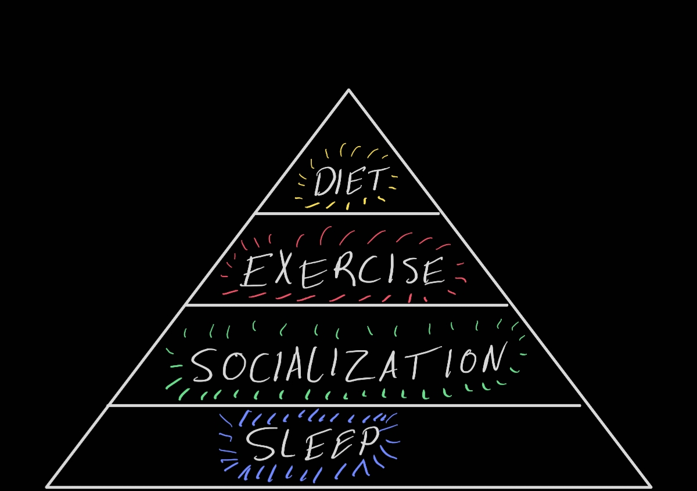

# Introduction
Maintaining good health supports everything from your ability to problem solve, work in a day job, and care for others. As a result, being in good health can help people to pursue a goal and improve the world. There are many conflicting opinions on maintaining good health, so I will try to stick to the most important aspects of health. To start with, it might be interesting to think of things that are **not** good for your health:

1. Lack of sleep
2. Being sedentary all-day
3. Lacking human interaction
4. Getting injured
6. Lacking nutrients
7. Isolation or loneliness
8. Stress

All these unhealthy pits to avoid can be either eliminated or avoided completely by focusing on sleep, socialization, exercise, and diet (I will argue in that order).

## A Health Pyramid

What follows is how I like to organize my priorities in terms of health. Each level of the pyramid relies on **sleep**, so it is at the base of health and it is my priority. Interacting with people and giving to people is also a necessity to live because humans are evolutionarily social creatures - **socialization** is ingrained in our biology. **Exercise** comes next since it is not necessary to focus on, but it reaps a surprising amount of benefits in all aspects of health. **Diet** is last since this is more of a controversial topic but still plays a role in healthy living.

### Sleep
The most important thing to prioritize in this model is getting 7 - 9 hours of **quality** sleep because your body simply performs every other function more poorly to the detriment of yourself and others.

Sleep cycles are divided into 3 periods - light, deep, and REM sleep - with each cycle lasting around 1.5 hours. The average person needs around 5 cycles a day. Doing the math, the average person needs around 7.5 hours of sleep. I like to give myself a buffer of 30 minutes (8 hours) to be on the safe side.

To ensure sleep quality, it's best to be in bed and wake up at the same time every day (+- 1 hour). I also try to limit bright light at night while getting 10 minutes of direct sunlight in the morning. All these things add up to set the Circadian Rhythm in that brain that makes it easier to fall asleep while also increasing sleep quality.

### Socialization
After being able to function properly with enough sleep, it's important to be involved in a community around you where you can talk to people and give to others. Humans have evolved to be social and it is ingrained in our biology. As much as it is tempting to focus on one's work or something that would still benefit the world while ignoring others, being lonely is known to cause all sorts of physical issues such as increased cortisol (stress). Being with people is also one of the things that makes life meaningful to so many people while also allowing you to directly increase the amount of good in the world.

### Exercise
While most people can manage to satisfy their sleep and socialization needs, it is sometimes difficult to build exercise into a time management plan. I like to perform some sort of exercise every day even if it is just a quick walk as any form of exercise provides similar benefits.

Now down to some details. The key forms of exercise are what I like to label VO2 max training, strength training, and aerobic training.
1. VO2 max training reduces resting heart rate and all-cause mortality. It can be performed using swimming, cycling, or sprinting where you engage in 30 seconds to 2 minutes of maximal intensity exercise and then rest for a few minutes. Then perform this 4 to 12 times.
2. Strength training makes it easier to perform most physical tasks, reduces bone density deterioration, and increases muscle mass. This is commonly associated with weightlifting and callisthenics.
3. Aerobic training includes 30 minutes or more of endurance work like running or swimming. This is generally lower intensity training that (speaking in informal terms) builds heart and lung strength.

I like to incorporate all three forms of training every week to ensure I have all bases covered. It's also important to have a day of rest between exercising a particular muscle group. For example, I like to avoid leg training before a VO2 max training day.

### Diet
Food is a personal and culturally important aspect of daily life which is why it is the last priority for health. As a general guideline, eating foods that are high in fibre, protein, unsaturated fats, vitamins, or minerals is good to focus on. Eating foods with a high yield of these nutrients will ensure that you get all the nutrients needed which promotes more energy and fewer cravings for food throughout the day. Similarly, it is generally a good idea to avoid "processed foods" that have been put through a pipeline of added ingredients and procedures that may take away from the nutrients in the food.

## Conclusion
Creating a habit of staying healthy supports almost every other area of life regardless of whether someone is a musician, an entrepreneur, or a doctor. I find that prioritising these four pillars of health makes it easier to make them a habit that can be sustained over the long term.

---
Thank you for reading and stay healthy!